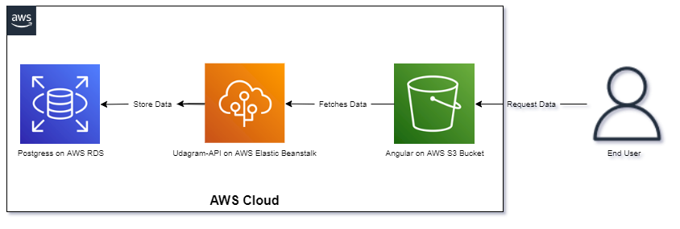

## Description

**udagram is fullstack application build in Angluar and nodejs**

provided by udacity to be hosted in AWS with pipeline using CircleCi

**The Project is for the Advanced Full-Stack Web Development Nanodegree Program**

built with :->

-   [Angular](https://angular.io/) - Single Page Application Framework
-   [Node](https://nodejs.org/) - Javascript Runtime
-   [Express](https://expressjs.com/) - Javascript API Framework

### AWS Cloud setup

-   RDS - database name : udagram
-   RDS - database port : 5432
-   RDS - Database Host : [database-1.c821gx45oq5b.us-east-1.rds.amazonaws.com](database-1.c821gx45oq5b.us-east-1.rds.amazonaws.com)
-   frontend - [S3 : http://udagramzbucket.s3-website-us-east-1.amazonaws.com](http://udagramzbucket.s3-website-us-east-1.amazonaws.com)
-   EB url / api link : [http://udagram-api-dev.eba-v3qbepu3.us-east-1.elasticbeanstalk.com/](http://udagram-api-dev.eba-v3qbepu3.us-east-1.elasticbeanstalk.com/)



### Environment Variables

set Environment Variables in CircleCi and EB

using the command

```
eb setenv key=value
```

to all these variables

```
- PORT                = 3000
- POSTGRES_HOST       = <Database_IP_Address>
- POSTGRES_PORT       = <Database_Port>
- POSTGRES_DB         = <Database_Name>
- POSTGRES_USERNAME   = <Database_Username>
- POSTGRES_PASSWORD   = <Database_Password>
- URL                 = <Url>
- JWT_SECRET          = <Any_PassPhrase>
- AWS_REGION          = <us-east-1>
- AWS_PROFILE         = <Profile>
- AWS_BUCKET          = <Bucket_Name>

```

> Note: you will find screanshots and diagrams in folders screenshots and diagrams
